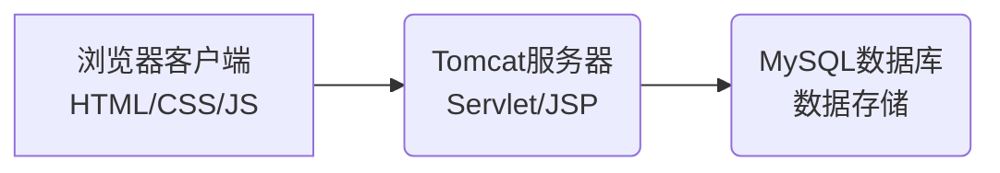
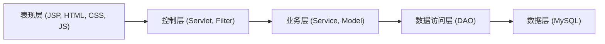
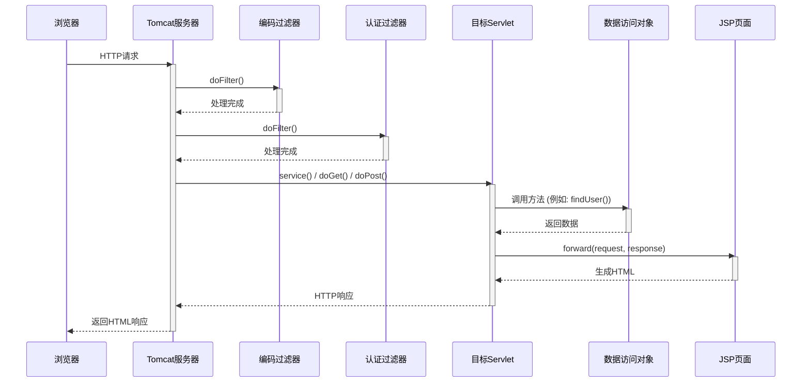
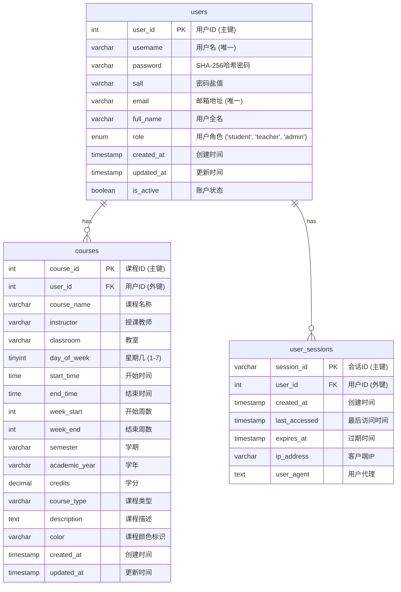
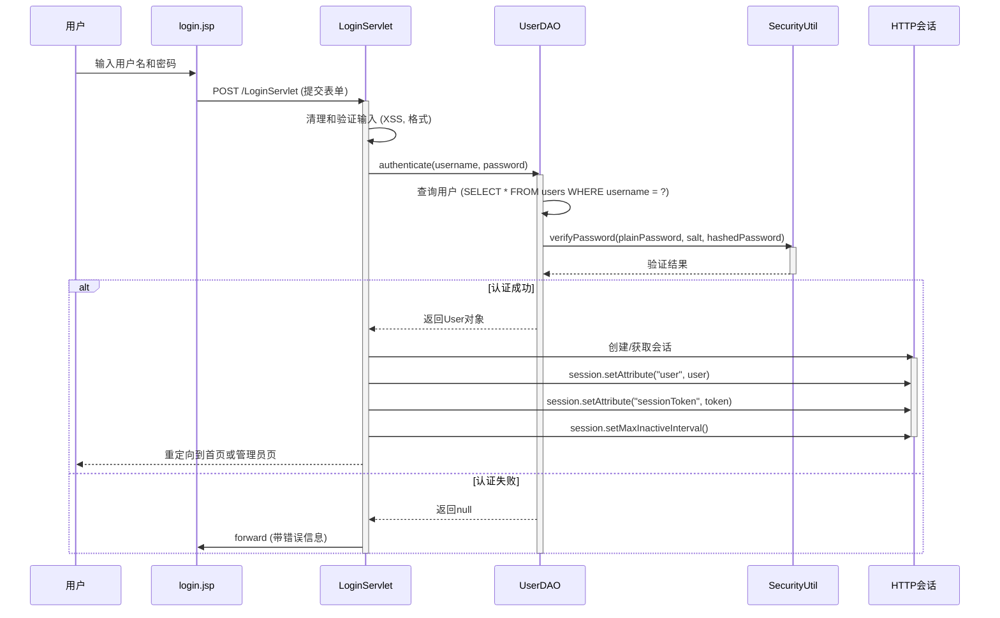

# 课灵通 - 支持二维码离线交互的可视化排课引擎

## 1. 简介

课灵通是一个基于 Java Web 技术的课程表管理系统。该项目旨在为用户提供一个便捷的平台，用于管理课程信息、查看个人课程表，并支持用户注册与登录等基本功能。系统采用 Servlet 和 JSP 作为后端核心技术，MySQL 作为数据存储，并通过 Apache Tomcat 服务器部署。项目注重用户体验，设计了响应式 Web 界面，并考虑了安全性，如用户认证、会话管理及 XSS 防护。

系统的核心功能包括用户管理和课程管理。用户可以通过注册功能创建账户，并通过登录功能访问个人课程表。课程管理功能支持用户添加、修改、删除课程，同时提供智能的时间冲突检测算法，确保课程安排的合理性。此外，系统还为管理员提供了额外的管理权限，支持对用户和课程的全面管理。

该系统架构采用分层设计，包括表现层、控制层、业务层、数据访问层和数据层，以实现模块化和可维护性。表现层负责与用户交互，控制层处理请求和响应，业务层实现核心逻辑，数据访问层封装数据库操作，而数据层负责数据的存储与管理。这种设计不仅提高了代码的可读性和可维护性，还为未来的功能扩展提供了良好的基础.

## 2. 系统架构

### 2.1 总体架构

系统采用经典的浏览器-服务器-数据库三层架构。用户通过浏览器与 Tomcat 服务器上部署的 Java Web 应用进行交互，应用再与 MySQL 数据库进行数据存取。这种架构设计清晰地分离了用户界面、业务逻辑和数据存储，确保了系统的可维护性和扩展性。

在浏览器端，用户通过响应式 Web 界面提交请求，界面由 HTML、CSS 和 JavaScript 构成，支持多设备访问。服务器端使用 Servlet 和 JSP 技术处理请求，执行业务逻辑，并生成动态内容返回给客户端。数据库层则负责存储用户信息、课程数据和会话记录，确保数据的持久性和一致性。

这种三层架构不仅提高了系统的性能，还为未来的功能扩展提供了良好的基础。例如，前端可以通过引入现代化框架（如 React 或 Vue.js）进行升级，而后端可以通过 RESTful API 的方式与其他系统集成。同时，数据库层可以通过优化索引和使用连接池进一步提升查询效率.



### 2.2 分层架构

系统内部采用分层架构，明确各层职责，提高代码的模块化和可维护性。表现层负责与用户交互，主要通过 JSP 页面和 HTML、CSS、JavaScript 实现动态内容的渲染和用户界面的响应式设计。控制层通过 Servlet 和 Filter 处理用户请求和响应，负责请求的路由、参数验证以及安全性检查。业务层实现核心逻辑，包括用户认证、课程管理和时间冲突检测等功能。数据访问层封装了与数据库的交互逻辑，通过 DAO 类执行数据的增删改查操作，确保数据操作的统一性和安全性。数据层则负责数据的存储与管理，使用 MySQL 数据库提供可靠的持久化支持。

这种分层设计不仅提高了代码的可读性和维护性，还使得系统的功能模块化，便于后续的功能扩展和性能优化。例如，表现层可以通过引入现代化的前端框架进行升级，而业务层的逻辑可以通过添加新的服务类来扩展功能。数据访问层的封装也使得数据库的迁移和优化更加灵活，为系统的长期发展提供了良好的基础。



### 2.3 包结构

项目后端代码主要组织在 `com.schedule` 包下，具体子包结构如下：

* `com.schedule.servlet`: 包含所有 Servlet 类，负责处理 HTTP 请求和响应。这些类实现了系统的核心功能，例如用户认证、课程管理和管理员操作。每个 Servlet 都通过 `web.xml` 配置了 URL 映射，确保请求能够正确路由到对应的处理逻辑。
* `com.schedule.model`: 包含数据模型类（POJO），如 `User.java` 和 `Course.java`。这些类用于表示系统中的核心实体，并通过 getter 和 setter 方法提供数据访问接口。模型类通常与数据库表结构一一对应，便于数据的存储和操作。
* `com.schedule.dao`: 包含数据访问对象（DAO）类，负责与数据库进行交互。DAO 类封装了数据库操作逻辑，例如增删改查和复杂查询。通过 DAO 层，系统实现了数据操作的统一性和安全性，同时降低了业务逻辑与数据库操作之间的耦合。
* `com.schedule.util`: 包含工具类，如数据库连接、安全处理等。这些工具类提供了通用功能，例如密码哈希、数据验证和 JSON 响应生成，简化了系统开发中的重复性任务。
* `com.schedule.filter`: 包含过滤器类，用于请求预处理和响应后处理，如编码设置和身份验证。过滤器通过 `web.xml` 配置，可以对特定 URL 模式的请求进行拦截和处理，例如设置字符编码或检查用户会话状态。

这种包结构设计清晰地分离了系统的不同功能模块，增强了代码的可读性和维护性，同时为未来的功能扩展提供了良好的基础.

### 2.4 请求处理流程

系统web端的请求处理主要由 `web.xml` 文件配置。典型的请求处理流程如下：

1. 客户端（浏览器）发送 HTTP 请求。
2. 请求首先经过在 `web.xml` 中配置的过滤器（Filters），如 `EncodingFilter` 进行字符编码设置，`AuthenticationFilter` 进行身份验证。
3. 根据 `web.xml` 中的 Servlet 映射，请求被路由到相应的 Servlet 进行处理。
4. Servlet 调用 DAO 对象访问数据库，执行业务逻辑。
5. Servlet 将处理结果（数据模型）传递给 JSP 页面。
6. JSP 页面渲染动态内容，生成 HTML 响应返回给客户端。

整个流程通过分层设计实现了请求的高效处理和逻辑的清晰分离。过滤器负责对请求进行预处理，例如设置字符编码或验证用户身份，确保请求的合法性和安全性。Servlet 是核心的业务处理组件，负责根据请求参数调用相应的服务或数据库操作。DAO 层封装了数据库的具体操作，确保数据的统一管理和安全性。最后，JSP 页面负责将处理结果以用户友好的方式呈现给客户端。

这种设计不仅提高了系统的可维护性，还为功能扩展提供了良好的基础。例如，可以通过添加新的过滤器来实现更复杂的安全检查，或者通过扩展 DAO 层来支持更多的数据库操作。此外，JSP 页面可以通过引入现代化的前端框架进一步优化用户体



#### 关键配置

* **过滤器 (Filters):**

  * `EncodingFilter`: 确保所有请求和响应使用 UTF-8 编码。该过滤器通过设置请求和响应的字符编码，解决了中文乱码问题，确保系统能够正确处理多语言输入和输出。它在 `web.xml` 中配置为对所有请求生效，保证了系统的统一编码处理。

    ```xml
    <filter>
        <filter-name>EncodingFilter</filter-name>
        <filter-class>com.schedule.filter.EncodingFilter</filter-class>
        <init-param>
            <param-name>encoding</param-name>
            <param-value>UTF-8</param-value>
        </init-param>
    </filter>
    <filter-mapping>
        <filter-name>EncodingFilter</filter-name>
        <url-pattern>/*</url-pattern>
    </filter-mapping>
    ```
  * `AuthenticationFilter`: 对受保护的资源进行身份验证检查。该过滤器通过拦截用户请求，验证用户是否已登录，并确保只有经过身份验证的用户才能访问特定资源。它在 `web.xml` 中配置了多个 URL 模式，覆盖了课程管理和管理员功能相关的页面和 Servlet。

    ```xml
    <filter>
        <filter-name>AuthenticationFilter</filter-name>
        <filter-class>com.schedule.filter.AuthenticationFilter</filter-class>
    </filter>
    <filter-mapping>
        <filter-name>AuthenticationFilter</filter-name>
        <url-pattern>/add-course.jsp</url-pattern>
        <!-- 其他受保护的URL -->
    </filter-mapping>
    ```
* **Servlet 映射:** `web.xml` 定义了 URL 模式到具体 Servlet 类的映射。例如，`/LoginServlet` URL 会被 `com.schedule.servlet.LoginServlet` 处理。通过这种映射机制，系统能够根据用户请求的 URL 将其路由到对应的业务逻辑处理组件。

  ```xml
  <servlet>
      <servlet-name>LoginServlet</servlet-name>
      <servlet-class>com.schedule.servlet.LoginServlet</servlet-class>
  </servlet>
  <servlet-mapping>
      <servlet-name>LoginServlet</servlet-name>
      <url-pattern>/LoginServlet</url-pattern>
  </servlet-mapping>
  ```

这种过滤器和 Servlet 的配置方式确保了系统的安全性和功能的模块化，同时为后续的功能扩展提供了良好的基础。例如，可以通过添加新的过滤器来实现更复杂的安全检查，或者通过扩展 Servlet 映射来支持更多的业务逻辑。

## 3. 数据管理

### 3.1 数据库概览

系统使用 MySQL 8.4.5 作为关系型数据库存储数据。数据库名为 `schedule_db`，字符集为 `utf8mb4`，确保能够支持多语言字符集和表情符号等特殊字符的存储需求。该数据库设计充分考虑了系统的功能需求和性能优化，包含用户表、课程表和用户会话表等核心数据表。

用户表 (`users`) 负责存储用户的基本信息，包括用户名、密码、邮箱、角色等，同时通过密码盐值和哈希算法增强安全性。课程表 (`courses`) 用于存储用户创建的课程信息，支持复杂的时间安排和学期管理。用户会话表 (`user_sessions`) 则记录用户的登录会话信息，用于实现会话管理和安全控制。

数据库的设计还通过索引优化了查询性能，例如在用户表中为用户名、邮箱和角色字段创建索引，在课程表中为时间和周数字段创建复合索引。这些优化措施确保了系统在处理大量数据时仍能保持高效的响应速度。此外，数据库还通过外键约束和检查约束保证了数据的一致性，例如课程表中的时间范围检查和周数范围检查。

通过这些设计，`schedule_db` 数据库不仅满足了当前系统的功能需求，还为未来的扩展提供了良好的基础，例如支持更多的用户角色、课程类型或复杂的统计分析功能.

### 3.2 数据库表结构

系统主要包含以下数据表：`users`, `courses`, 和 `user_sessions`。



数据表设计的优势

- 模块化设计: 每个数据表专注于存储特定类型的数据，确保了数据的逻辑分离和结构清晰。
- 安全性增强: 用户表通过密码盐值和哈希算法保护用户密码，用户会话表记录详细的会话信息以支持安全审计。
- 性能优化: 数据表设计中使用了索引和约束，例如用户表中的唯一索引和课程表中的时间范围检查，确保了查询效率和数据一致性。
- 扩展性强: 数据表设计为未来的功能扩展提供了良好的基础，例如支持更多的用户角色、课程类型或复杂的统计分析功能。

通过这些设计，系统能够高效地管理用户、课程和会话数据，同时满足当前功能需求和未来扩展的可能性。

#### 3.2.1 用户表

用户表存储系统中的用户信息，包括认证凭据、角色和账户状态等。通过密码盐值和哈希算法增强了安全性，同时支持多种用户角色（如学生、教师和管理员），以满足不同用户的功能需求。

| 字段名         | 类型         | 约束/描述                                                  |
| -------------- | ------------ | ---------------------------------------------------------- |
| `user_id`    | INT          | 主键, 自增, 用户唯一标识符                                 |
| `username`   | VARCHAR(50)  | 非空, 唯一, 用户登录名                                     |
| `password`   | VARCHAR(255) | 非空, 存储哈希后的密码                                     |
| `salt`       | VARCHAR(255) | 非空, 用于密码哈希的盐值                                   |
| `email`      | VARCHAR(100) | 唯一, 用户邮箱                                             |
| `full_name`  | VARCHAR(100) | 用户全名                                                   |
| `role`       | ENUM         | 用户角色 ('student', 'teacher', 'admin'), 默认为 'student' |
| `created_at` | TIMESTAMP    | 创建时间, 默认为当前时间戳                                 |
| `updated_at` | TIMESTAMP    | 更新时间, 默认为当前时间戳，更新时自动更新                 |
| `is_active`  | BOOLEAN      | 账户是否激活, 默认为 TRUE                                  |

#### 3.2.2 课程表

课程表存储用户创建的课程信息，支持复杂的时间安排和学期管理。通过外键关联用户表，确保课程数据与用户数据的一致性。课程表还包含课程类型、学分和颜色标识等字段，以便于课程的分类和可视化展示。

| 字段名            | 类型         | 约束/描述                                   |
| ----------------- | ------------ | ------------------------------------------- |
| `course_id`     | INT          | 主键, 自增, 课程唯一标识符                  |
| `user_id`       | INT          | 非空, 外键关联 `users(user_id)`, 级联删除 |
| `course_name`   | VARCHAR(100) | 非空, 课程名称                              |
| `instructor`    | VARCHAR(50)  | 授课教师                                    |
| `classroom`     | VARCHAR(50)  | 教室                                        |
| `day_of_week`   | TINYINT      | 非空, 星期几 (1-7)                          |
| `start_time`    | TIME         | 非空, 课程开始时间                          |
| `end_time`      | TIME         | 非空, 课程结束时间, 必须晚于 `start_time` |
| `week_start`    | INT          | 开始周数                                    |
| `week_end`      | INT          | 结束周数, 必须大于等于 `week_start`       |
| `semester`      | VARCHAR(20)  | 学期                                        |
| `academic_year` | VARCHAR(10)  | 学年                                        |
| `credits`       | DECIMAL(3,1) | 学分                                        |
| `course_type`   | VARCHAR(20)  | 课程类型 (如：必修课)                       |
| `description`   | TEXT         | 课程描述                                    |
| `color`         | VARCHAR(7)   | 课程颜色标识, 默认为 '#3498db'              |

#### 3.2.3 用户会话表

用户会话表记录用户的登录会话信息，包括会话ID、用户ID、创建时间和过期时间等。通过存储客户端IP地址和用户代理信息，系统能够实现更精细的会话管理和安全控制。

| 字段名            | 类型         | 约束/描述                                   |
| ----------------- | ------------ | ------------------------------------------- |
| `session_id`    | VARCHAR(128) | 主键, 会话唯一标识符                        |
| `user_id`       | INT          | 非空, 外键关联 `users(user_id)`, 级联删除 |
| `created_at`    | TIMESTAMP    | 创建时间, 默认为当前时间戳                  |
| `last_accessed` | TIMESTAMP    | 最后访问时间, 更新时自动更新                |
| `expires_at`    | TIMESTAMP    | 非空, 会话过期时间                          |
| `ip_address`    | VARCHAR(45)  | 客户端 IP 地址                              |
| `user_agent`    | TEXT         | 用户代理字符串                              |

### 3.3 数据访问层

数据访问对象 (DAO) 封装了与数据库的交互逻辑，是系统数据层的重要组成部分。通过 DAO 层，系统实现了数据操作的统一性、安全性和可维护性，同时降低了业务逻辑与数据库操作之间的耦合。

DAO 层的主要职责包括：

1. **数据的增删改查**: 提供对数据库表的基本操作，例如插入新记录、更新现有记录、删除记录以及查询记录。
2. **复杂查询和统计**: 支持基于多条件的复杂查询，例如按时间范围筛选课程或统计用户角色分布。
3. **数据一致性检查**: 在执行数据库操作时，确保数据的完整性和一致性，例如检查课程时间冲突或用户名的唯一性。
4. **事务管理**: 在需要批量操作时，通过事务机制确保数据操作的原子性和可靠性。

DAO 层的设计不仅提高了代码的可读性和维护性，还为系统的扩展提供了良好的基础。例如，可以通过扩展 DAO 类添加新的数据操作方法，支持更多的业务需求

* **`UserDAO.java`**: 处理用户数据的增删改查。负责用户数据的管理，包括用户注册、登录验证、信息更新和删除等功能。它通过密码盐值和哈希算法增强了用户数据的安全性。
  * `addUser(User user)`: 添加新用户，包括密码加盐哈希。

    ```java
    // 生成盐值和哈希密码
    String salt = SecurityUtil.generateSalt();
    String hashedPassword = SecurityUtil.hashPassword(user.getPassword(), salt);
    // ... SQL INSERT ...
    ```
  * `authenticate(String username, String password)`: 验证用户凭据。

    ```java
    // ... SQL SELECT ...
    if (rs.next()) {
        String storedPassword = rs.getString("password");
        String salt = rs.getString("salt");
        if (SecurityUtil.verifyPassword(password, salt, storedPassword)) {
            return mapResultSetToUser(rs);
        }
    }
    ```
* **`CourseDAO.java`**: 处理课程数据的增删改查。负责课程数据的管理，包括课程的添加、修改、删除以及时间冲突检测等功能。它支持复杂的查询，例如按课程类型或时间范围筛选课程。
  * `addCourse(Course course)`: 添加新课程。
  * `findByUserId(int userId)`: 根据用户ID查询课程。
  * `checkTimeConflict(Course course)`: 检查课程时间冲突.

### 3.4 数据库连接

数据库连接通过 `DatabaseUtil.java` 工具类管理。该工具类封装了数据库连接的创建、关闭以及测试功能，确保了系统与 MySQL 数据库的高效交互，同时简化了开发过程中与数据库相关的操作。

#### 功能概述

1. **加载数据库驱动**: 在静态代码块中加载 MySQL JDBC 驱动，确保在应用启动时驱动已准备好。
2. **获取数据库连接**: 提供 `getConnection()` 方法，通过 JDBC URL、用户名和密码创建数据库连接。
3. **关闭数据库连接**: 提供 `closeConnection()` 方法，确保数据库连接在使用后能够正确关闭，避免资源泄漏。
4. **测试数据库连接**: 提供 `testConnection()` 方法，用于验证数据库连接是否正常，便于在部署前进行环境检查。
5. **获取数据库信息**: 提供方法获取数据库版本信息和连接配置，便于调试和监控。
6. **统计功能**: 提供方法获取用户数量等基本统计信息，支持系统的管理功能。

```java
public class DatabaseUtil {
    private static final String DRIVER = "com.mysql.cj.jdbc.Driver";
    private static final String URL = "jdbc:mysql://localhost:3306/schedule_db?useSSL=false&serverTimezone=Asia/Shanghai&allowPublicKeyRetrieval=true";
    private static final String USERNAME = "root";
    private static final String PASSWORD = "Minecon2021"; // 注意：密码硬编码在代码中

    static {
        try {
            Class.forName(DRIVER);
        } catch (ClassNotFoundException e) {
            throw new RuntimeException("无法加载数据库驱动", e);
        }
    }

    public static Connection getConnection() throws SQLException {
        return DriverManager.getConnection(URL, USERNAME, PASSWORD);
    }
    // ...
}
```

#### 使用场景

- DAO 层操作: DAO 类通过 DatabaseUtil.getConnection() 获取数据库连接，用于执行 SQL 查询和更新操作。
- 系统监控: 管理员可以通过 testConnection() 方法检查数据库连接状态，确保系统运行环境正常。
- 调试与诊断: 开发人员可以使用 getDatabaseVersion() 方法获取数据库版本信息，便于诊断兼容性问题。

通过 DatabaseUtil.java 的封装，系统实现了与数据库的高效交互，同时简化了开发流程，为后续功能扩展提供了良好的基础。

## 4. 核心功能

### 4.1 用户认证

用户认证是课灵通系统的核心功能之一，确保用户能够安全地访问其个人课程表和相关功能。系统通过注册、登录和会话管理实现用户认证，并采用多层次的安全机制保护用户数据。

#### 4.1.1 用户注册

用户可以通过注册页面创建新账户。注册时，系统会验证用户名和邮箱的唯一性，并对密码进行加盐哈希处理后存储到数据库中。注册流程如下：

1. 用户填写注册表单，包括用户名、密码、邮箱和全名。
2. 前端进行基本的表单验证，例如检查字段是否为空。
3. 后端通过 `RegisterServlet` 处理注册请求，调用 `UserDAO` 检查用户名和邮箱是否已存在。
4. 如果验证通过，系统使用 `SecurityUtil` 生成密码盐值并对密码进行哈希处理。
5. 用户信息存储到 `users` 表中，并返回注册成功的消息。

#### 4.1.2 用户登录

用户通过登录页面提交用户名和密码进行身份验证。登录流程如下：

1. 用户填写登录表单并提交。
2. 后端通过 `LoginServlet` 处理登录请求，调用 `UserDAO.authenticate()` 验证用户名和密码。
3. 如果验证成功，系统创建 HTTP 会话并存储用户信息。
4. 用户被重定向到个人主页或管理员页面。
5. 如果验证失败，系统返回错误消息并重新加载登录页面。



**登录表单 (`login.jsp`)**

```html
<form id="loginForm" action="LoginServlet" method="post">
    <div class="form-group">
        <label for="username">用户名</label>
        <input type="text" id="username" name="username" class="form-control" required>
    </div>
    <div class="form-group">
        <label for="password">密码</label>
        <input type="password" id="password" name="password" class="form-control" required>
    </div>
    <div class="checkbox-group">
        <input type="checkbox" id="rememberMe" name="rememberMe">
        <label for="rememberMe">记住我（7天内免登录）</label>
    </div>
    <button type="submit" class="btn" id="loginBtn">登录</button>
</form>
```

客户端通过 `login.js` 进行基本的表单验证。

#### 4.1.3 会话管理

系统通过 HTTP 会话管理用户的登录状态。会话超时时间默认为 30 分钟，用户可以选择“记住我”功能，将会话有效期延长至 7 天。会话管理的主要功能包括：

- 创建会话：用户登录成功后，系统生成唯一的会话 ID 并存储用户信息。
- 会话验证：通过 `AuthenticationFilter` 验证用户会话的有效性，确保未登录用户无法访问受保护资源。
- 会话销毁：用户登出时，系统销毁当前会话并清除相关数据。

通过用户认证功能，课灵通系统确保了用户数据的安全性，同时为用户提供了便捷的访问体
用户登录成功后，系统会创建 HTTP 会话，并存储用户信息。会话超时时间默认为30分钟，如果用户选择“记住我”，则会话超时时间延长至7天。

`web.xml` 中也定义了全局会话配置：

```xml
<session-config>
    <session-timeout>30</session-timeout> <!-- 单位：分钟 -->
    <cookie-config>
        <http-only>true</http-only>
        <secure>false</secure> <!-- 注意：在生产环境中应设为true (HTTPS) -->
    </cookie-config>
</session-config>
```

### 4.2 课程管理

用户登录后可以进行课程的添加、修改、删除和查看。课程管理功能是课灵通系统的核心模块之一，旨在为用户提供便捷的课程操作，同时确保数据的完整性和安全性。

#### 4.2.1 添加课程

用户通过 `AddCourseServlet` 添加新课程。添加课程时，系统会对用户输入的数据进行严格验证，包括课程名称、时间安排、周次范围等。同时，服务器会检查课程时间是否与该用户已有课程冲突，以确保课程安排的合理性。添加流程如下：

1. 用户填写课程添加表单，包括课程名称、授课教师、教室、时间安排、周次范围等信息。
2. 前端进行基本的表单验证，例如检查必填字段是否为空。
3. 后端通过 `AddCourseServlet` 处理添加请求，调用 `CourseDAO` 检查时间冲突和课程名称重复。
4. 如果验证通过，系统将课程信息存储到 `courses` 表中，并返回添加成功的消息。
5. 如果验证失败，系统会返回错误消息，并保留用户输入的数据以便用户修改。

#### 4.2.2 查看课程表

用户通过 `ViewScheduleServlet` 查看个人课程表。课程数据从 `courses` 表中获取，并按星期和时间排序。系统支持多种视图模式，包括：

- **周视图**: 按星期分组显示课程，便于用户查看一周的课程安排。
- **日视图**: 显示特定日期的课程，适合用户查看当天的课程安排。
- **列表视图**: 按课程名称排序的简单列表，便于用户快速浏览所有课程。

此外，系统还提供课程统计功能，例如计算总课程数、总学分，以及按课程类型统计课程分布。

#### 4.2.3 修改与删除课程

用户可以通过 `EditCourseServlet` 和 `UpdateCourseServlet` 修改课程信息，通过 `DeleteCourseServlet` 删除课程。操作流程如下：

1. **修改课程**:

   - 用户通过 `EditCourseServlet` 加载课程信息，并在编辑页面中修改课程数据。
   - 后端通过 `UpdateCourseServlet` 处理更新请求，调用 `CourseDAO` 验证数据的合法性和时间冲突。
   - 如果更新成功，系统将修改后的课程信息存储到数据库，并返回成功消息。
2. **删除课程**:

   - 用户通过 `DeleteCourseServlet` 删除课程。系统会校验用户权限，确保用户只能删除自己的课程。
   - 删除操作支持单个课程删除和批量删除（清空所有课程）。

通过课程管理功能，课灵通系统为用户提供了灵活的课程操作方式，同时确保数据的安全性和一致性.

### 4.3 管理员功能

管理员拥有更高级别的权限，可以管理所有用户和课程。管理员功能模块旨在为系统提供全面的管理能力，确保数据的完整性和安全性，同时简化系统的维护工作。

#### 4.3.1 用户管理

管理员可以通过 `AdminUserServlet` 查看所有用户列表、编辑用户信息（包括角色、密码）、删除用户。具体功能包括：

1. **查看用户列表**: 管理员可以通过 `listUsers` 方法获取所有用户信息，并在页面中展示用户的基本信息，如用户名、邮箱、角色等。
2. **编辑用户信息**: 管理员可以通过 `editUser` 方法加载用户信息，并在编辑页面中修改用户的角色、邮箱、全名等数据。支持密码更新功能，管理员可以为用户设置新密码。
3. **删除用户**: 管理员可以通过 `deleteUser` 方法删除指定用户，同时级联删除该用户的所有课程。系统会校验管理员权限，防止删除自身账户。

#### 4.3.2 课程管理

管理员可以通过 `AdminCourseServlet` 查看所有课程、编辑任何用户的课程信息、删除任何课程。具体功能包括：

1. **查看课程列表**: 管理员可以通过 `listCourses` 方法获取所有课程信息，并在页面中展示课程的基本信息，如课程名称、授课教师、时间安排等。
2. **编辑课程信息**: 管理员可以通过 `editCourse` 方法加载课程信息，并在编辑页面中修改课程的时间安排、授课教师、教室等数据。支持跨用户的课程编辑功能。
3. **删除课程**: 管理员可以通过 `deleteCourse` 方法删除指定课程，无需验证课程所属用户。
4. **查看用户课程**: 管理员可以通过 `viewUserCourses` 方法查看指定用户的所有课程，便于管理用户的课程安排。

**获取所有课程列表:**

```java
// In AdminCourseServlet.java
private void listCourses(HttpServletRequest request, HttpServletResponse response)
        throws ServletException, IOException {
    List<Course> courses = courseDAO.getAllCourses(); // Fetches all courses
    List<User> users = userDAO.getAllUsers(); // Fetches all users for context
  
    request.setAttribute("courses", courses);
    request.setAttribute("users", users);
    request.getRequestDispatcher("/admin-courses.jsp").forward(request, response);
}
```

**管理员删除课程:**

```java
// In AdminCourseServlet.java, called by doPost with action="delete"
private void deleteCourse(HttpServletRequest request, HttpServletResponse response, HttpSession session)
        throws IOException {
    // ... parameter parsing and validation ...
    int courseId = Integer.parseInt(courseIdStr);
    Course course = courseDAO.findById(courseId);
    // ... null check ...
    boolean success = courseDAO.adminDeleteCourse(courseId); // adminDeleteCourse does not require userId
    // ... set messages and redirect ...
}
```

对应的 `CourseDAO.adminDeleteCourse` 方法：

```java
public boolean adminDeleteCourse(int courseId) {
    String sql = "DELETE FROM courses WHERE course_id = ?";
    // ... executes SQL ...
}
```

#### 4.3.3 系统统计

管理员可以通过 `AdminStatsServlet` 查看系统的统计信息，例如：

- 用户角色分布：统计学生、教师和管理员的数量。
- 课程类型分布：统计必修课、选修课等课程类型的数量。
- 活跃用户：统计最近登录的用户数量。

管理员功能模块通过权限校验机制确保只有管理员能够访问相关资源，同时提供了全面的管理能力，为系统的维护和扩展提供了良好的支持.

## 5. 前端系统组件

课灵通系统的前端设计注重响应式布局，以确保用户在不同设备（如手机、平板和桌面）上都能获得良好的使用体验。通过 CSS 媒体查询和灵活的网格布局，系统实现了页面内容的动态调整。

### 5.1 响应式布局

系统的主要页面（如 `admin-courses.jsp` 和 `edit-course.jsp`）使用了 CSS 媒体查询来适配不同屏幕宽度。例如，在屏幕宽度小于 768px 时，表单布局会调整为单列显示，按钮和操作区域会自动垂直排列，以便于用户在小屏设备上操作。

```css
/* admin-courses.jsp: 响应式设计 */
@media (max-width: 768px) {
    .modal-content {
        width: 95%;
        margin: 10px auto;
        max-height: 95vh;
    }
    .form-row {
        grid-template-columns: 1fr;
    }
    .form-actions {
        flex-direction: column;
    }
    .form-actions button {
        width: 100%;
        margin-bottom: 0.5rem;
    }
}
```

此外，表格内容在屏幕宽度小于 1024px 时会调整字体大小，以确保数据在小屏设备上仍然清晰可读。

```css
/* 表格响应式设计 */
@media (max-width: 1024px) {
    table {
        font-size: 0.9rem;
    }
    th, td {
        padding: 0.5rem;
    }
}
```

### 5.2 前端优化

为了提升用户体验，系统在前端实现了以下优化：

1. **表单验证**: 使用 JavaScript 实现客户端验证，减少不必要的服务器请求。例如，在 `admin-courses.js` 中，表单提交前会检查时间安排的合理性。

   ```javascript
   // admin-courses.js: 时间验证
   const startTime = formData.get('startTime');
   const endTime = formData.get('endTime');
   if (startTime >= endTime) {
       alert('开始时间必须早于结束时间！');
       return;
   }
   ```
2. **异步操作**: 使用 `fetch` API 实现异步表单提交，避免页面刷新。例如，编辑课程时，系统会显示提交状态，并在服务器响应后更新页面。

   ```javascript
   // admin-courses.js: 异步提交表单
   fetch(window.location.pathname, {
       method: 'POST',
       body: formData
   }).then(response => {
       if (response.redirected) {
           window.location.href = response.url;
       } else {
           return response.text();
       }
   });
   ```
3. **错误与成功消息显示**: 在 JSP 页面中，通过会话属性动态显示操作结果。例如，在 `admin-courses.jsp` 中，成功或失败消息会在页面顶部以醒目的样式展示。

   ```jsp
   <% if (successMessage != null) { %>
       <div class="alert alert-success">
           <%= successMessage %>
       </div>
   <% } %>
   <% if (errorMessage != null) { %>
       <div class="alert alert-danger">
           <%= errorMessage %>
       </div>
   <% } %>
   ```

### 5.3 未来优化方向

为了进一步提升前端性能和用户体验，系统计划引入以下优化措施：

1. **前端框架**: 考虑使用现代化框架（如 React 或 Vue.js）重构部分页面，提升交互性能。
2. **懒加载**: 对课程表等数据密集型页面实现懒加载，减少初始加载时间。
3. **图表与可视化**: 在管理员统计页面中引入图表库（如 Chart.js），以更直观的方式展示系统数据。

通过响应式设计和前端优化，课灵通系统能够为用户提供流畅的操作体验，同时为未来的功能扩展奠定了良好的基础。

## 6. 后端系统组件

后端系统组件是课灵通项目的核心架构，由一系列相互协作的Java类构成。这些组件遵循分层设计原则，确保了系统的模块化、可维护性和可扩展性。核心组件包括Servlet类（处理HTTP请求和响应）、数据模型类（表示系统中的实体对象）和工具类（提供通用功能支持）。每个组件都有明确的职责范围，通过标准化的接口相互通信，形成一个完整的后端系统。以下详细介绍各个核心后端组件及其在系统中的作用。

### 6.1 Servlets

Servlets 是请求处理的核心。`web.xml` 中定义了所有 Servlet 及其 URL 映射。系统通过 Servlet 接收客户端请求，执行业务逻辑，并生成响应返回给客户端。每个 Servlet 都有明确的职责范围，确保了代码的模块化和可维护性。

| Servlet 类              | URL 模式                 | 主要职责                                           |
| ----------------------- | ------------------------ | -------------------------------------------------- |
| `LoginServlet`        | `/LoginServlet`        | 处理用户登录，验证用户凭据，创建会话               |
| `RegisterServlet`     | `/RegisterServlet`     | 处理用户注册，验证用户数据，创建新账户             |
| `LogoutServlet`       | `/LogoutServlet`       | 处理用户登出，销毁当前会话                         |
| `AddCourseServlet`    | `/AddCourseServlet`    | 添加新课程，验证课程数据，检查时间冲突             |
| `UpdateCourseServlet` | `/UpdateCourseServlet` | 更新课程信息，验证修改数据，检查时间冲突           |
| `EditCourseServlet`   | `/EditCourseServlet`   | 加载课程信息以供编辑，准备编辑表单                 |
| `DeleteCourseServlet` | `/DeleteCourseServlet` | 删除课程，检查权限，执行删除操作                   |
| `ViewScheduleServlet` | `/ViewScheduleServlet` | 显示用户课程表，支持多种视图模式                   |
| `AdminServlet`        | `/admin`               | 管理员主页，提供系统概览                           |
| `AdminUserServlet`    | `/admin/users`         | 管理员用户管理，提供用户列表、编辑和删除功能       |
| `AdminCourseServlet`  | `/admin/courses`       | 管理员课程管理，提供所有课程的管理功能             |
| `AdminStatsServlet`   | `/admin/stats`         | 显示系统统计数据，如用户数量、课程分布等           |
| `ProfileServlet`      | `/profile`             | 处理用户个人资料查看和更新，包括密码修改           |
| `QRCodeServlet`       | `/QRCodeServlet`       | 生成课程二维码，支持单课程和课表的二维码导出       |
| `QRImportServlet`     | `/QRImportServlet`     | 处理二维码导入，解析二维码中的课程信息并添加到系统 |
| `TestDatabaseServlet` | `/TestDatabaseServlet` | 测试数据库连接状态，用于系统诊断和调试             |
| `UserStatsServlet`    | `/UserStatsServlet`    | 显示用户个人统计数据，如课程总数、学分统计等       |

每个 Servlet 都遵循 MVC 设计模式中的控制器角色，负责接收 HTTP 请求，调用相应的业务逻辑（通常通过 DAO 层），并将结果发送回客户端。Servlet 处理请求的一般流程包括：

1. 获取请求参数并进行验证
2. 执行权限检查（如需要）
3. 调用相应的 DAO 方法处理业务逻辑
4. 准备响应数据（可能是 JSP 页面所需的属性或 JSON 格式的数据）
5. 转发到相应的 JSP 页面或直接返回响应

为了提高代码的可维护性，系统中的 Servlet 类通常遵循单一职责原则，每个 Servlet 只负责一个特定功能模块。例如，用户认证相关的功能由 `LoginServlet`、`RegisterServlet` 和 `LogoutServlet` 处理，而课程管理相关的功能则由 `AddCourseServlet`、`UpdateCourseServlet` 等处理。

此外，系统还实现了基于 Filter 的请求预处理机制，例如 `AuthenticationFilter` 用于验证用户身份，确保未登录用户无法访问受保护的资源。这种设计使得 Servlet 可以专注于业务逻辑的实现，而将通用的预处理逻辑提取到 Filter 中，提高了代码的复用性和可维护性。

### 6.2 数据模型

数据模型类位于 `com.schedule.model`包中，用于表示系统中的核心实体对象。这些类采用标准的JavaBean设计模式，包含私有成员变量和公共的getter/setter方法，确保了数据的封装性和访问控制。数据模型类是系统各层之间数据传输的载体，在表现层、业务层和数据访问层之间传递数据，同时也与数据库表结构相对应，便于数据的存储和操作。

* **`User.java`**: 表示用户实体，对应数据库中的 `users`表。用户模型包含用户身份认证、个人信息和权限控制所需的所有属性。

  ```java
  public class User {
      private int userId;          // 用户唯一标识符
      private String username;     // 用户登录名
      private String password;     // 通常不直接存储明文密码，DAO层面处理哈希
      private String salt;         // 密码盐值，用于增强密码安全性
      private String email;        // 用户邮箱
      private String fullName;     // 用户全名
      private String role;         // 用户角色(student/teacher/admin)
      private LocalDateTime createdAt; // 账户创建时间
      private LocalDateTime updatedAt; // 账户信息更新时间
      private boolean isActive;    // 账户状态标识
      // ... getters and setters ...
  }
  ```

  `User`类在系统中的主要用途包括：

  - 用户认证：`LoginServlet`通过 `UserDAO.authenticate()`方法验证用户凭据
  - 用户注册：`RegisterServlet`通过 `UserDAO.addUser()`方法创建新用户
  - 用户管理：管理员通过 `AdminUserServlet`管理用户信息
  - 会话管理：用户信息存储在HTTP会话中，用于维持用户登录状态
* **`Course.java`**: 表示课程实体，对应数据库中的 `courses`表。课程模型包含课程基本信息、时间安排、学期信息和分类属性等。

  ```java
  public class Course {
      private int courseId;        // 课程唯一标识符
      private int userId;          // 课程所属用户ID
      private String courseName;   // 课程名称
      private String instructor;   // 授课教师
      private String classroom;    // 教室
      private int dayOfWeek;       // 星期几(1-7)
      private LocalTime startTime; // 课程开始时间
      private LocalTime endTime;   // 课程结束时间
      private int weekStart;       // 开始周数
      private int weekEnd;         // 结束周数
      private String semester;     // 学期
      private String academicYear; // 学年
      private int credits;         // 学分
      private String courseType;   // 课程类型(如必修课、选修课)
      private String description;  // 课程描述
      private String color;        // 课程颜色标识(用于前端显示)
      private Timestamp createdAt; // 创建时间
      private Timestamp updatedAt; // 更新时间
      // ... getters and setters ...
  }
  ```

  `Course`类在系统中的主要用途包括：

  - 课程添加：`AddCourseServlet`通过 `CourseDAO.addCourse()`方法添加新课程
  - 课程查询：`ViewScheduleServlet`通过 `CourseDAO.findByUserId()`方法获取用户课程
  - 时间冲突检测：`CourseDAO.checkTimeConflict()`方法检查课程时间是否冲突
  - 课程统计：`UserStatsServlet`利用课程数据计算学分统计、课程分布等信息

除了基本的数据存储功能外，数据模型类还提供了一些辅助方法，如格式化时间、验证数据有效性等，以简化业务逻辑处理。通过统一的数据模型，系统实现了数据的一致性表示和处理，确保了各个组件之间的无缝协作。

数据模型类的设计充分考虑了系统的扩展性，预留了一些通用字段和方法，以便在未来添加新功能时能够平滑过渡。例如，`Course`类中的 `courseType`和 `color`字段支持灵活的课程分类和可视化展示，为课程表的个性化定制提供了基础。

### 6.3 工具类 (`com.schedule.util`)

工具类是课灵通系统的重要支持组件，位于 `com.schedule.util`包中。这些类提供了系统运行所需的各种通用功能，从数据库连接管理到安全处理，再到二维码生成与解析。通过将这些通用功能集中在工具类中，系统实现了代码的高度复用和模块化，同时也提高了开发效率和系统的可维护性。以下是系统中的核心工具类及其功能详解：

* **DatabaseUtil.java**: 数据库连接工具类，负责创建、管理和关闭数据库连接。该类通过静态方法提供数据库操作的基础支持，封装了JDBC连接的创建过程，简化了DAO层的实现。

  ```java
  // DatabaseUtil.java 示例：获取数据库连接
  public static Connection getConnection() throws SQLException {
      return DriverManager.getConnection(URL, USERNAME, PASSWORD);
  }

  // 测试数据库连接
  public static boolean testConnection() {
      try (Connection connection = getConnection()) {
          return connection != null && !connection.isClosed();
      } catch (SQLException e) {
          System.err.println("数据库连接测试失败: " + e.getMessage());
          return false;
      }
  }
  ```
* **SecurityUtil.java**: 安全工具类，提供了系统安全相关的核心功能，包括密码哈希与验证、盐值生成、防XSS攻击的HTML清理，以及会话令牌生成等。该类是系统安全防护的基石，确保了用户数据的安全性和系统的防攻击能力。

  ```java
  // SecurityUtil.java 示例：密码哈希与验证
  public static String hashPassword(String password, String salt) {
      try {
          MessageDigest digest = MessageDigest.getInstance(HASH_ALGORITHM);
          String saltedPassword = password + salt;
          byte[] hashBytes = digest.digest(saltedPassword.getBytes(StandardCharsets.UTF_8));
          return Base64.getEncoder().encodeToString(hashBytes);
      } catch (NoSuchAlgorithmException e) {
          throw new RuntimeException("哈希算法不可用", e);
      }
  }

  // 验证密码
  public static boolean verifyPassword(String password, String salt, String hashedPassword) {
      String hashToCheck = hashPassword(password, salt);
      return hashToCheck.equals(hashedPassword);
  }
  ```
* **JsonResponse.java**: JSON响应工具类，用于生成标准化的JSON格式响应数据。该类通过简单的静态方法，将服务器处理结果封装为前端可以直接使用的JSON字符串，支持成功和错误两种基本响应类型，以及携带额外数据的扩展响应。

  ```java
  // JsonResponse.java 示例：创建成功和错误响应
  public static String success(String message) {
      return "{\"status\":\"success\",\"message\":\"" + escapeJson(message) + "\"}";
  }

  public static String error(String message) {
      return "{\"status\":\"error\",\"message\":\"" + escapeJson(message) + "\"}";
  }
  ```
* **PasswordGenerator.java**: 密码生成工具类，用于系统初始化时生成测试账户的盐值和密码哈希。该类主要用于开发和测试环境，生成的SQL语句可直接用于数据库初始化脚本，简化了测试账户的创建过程。

  ```java
  // PasswordGenerator.java 示例：生成测试账户密码
  public static void main(String[] args) {
      String testSalt = SecurityUtil.generateSalt();
      String adminPassword = "admin123";
      String adminHash = SecurityUtil.hashPassword(adminPassword, testSalt);

      System.out.println("-- 管理员");
      System.out.println("INSERT INTO users (username, password, salt, email, full_name, role) VALUES");
      System.out.println("('admin', '" + adminHash + "', '" + testSalt + "', 'admin@schedule.com', '系统管理员', 'admin');");
  }
  ```
* **QRCodeUtil.java**: 二维码工具类，负责课程信息二维码的生成和解析。该类利用ZXing库实现二维码操作，支持将课程数据编码为二维码图片，以及从二维码图片中解析出课程信息，是课灵通系统离线交互特性的核心支持组件。

  ```java
  // QRCodeUtil.java 示例：生成二维码
  public static byte[] generateQRCode(String content) throws WriterException, IOException {
      Map<EncodeHintType, Object> hints = new HashMap<>();
      hints.put(EncodeHintType.CHARACTER_SET, "UTF-8");
      hints.put(EncodeHintType.ERROR_CORRECTION, ErrorCorrectionLevel.M);

      BitMatrix bitMatrix = new MultiFormatWriter().encode(content, BarcodeFormat.QR_CODE, WIDTH, HEIGHT, hints);
      BufferedImage image = MatrixToImageWriter.toBufferedImage(bitMatrix);

      ByteArrayOutputStream outputStream = new ByteArrayOutputStream();
      ImageIO.write(image, "PNG", outputStream);
      return outputStream.toByteArray();
  }
  ```
* **CourseDataUtil.java**: 课程数据工具类，提供课程数据的序列化和反序列化功能。该类负责课程对象与JSON格式数据之间的转换，支持单个课程和课程列表的处理，为二维码数据交换和前端数据展示提供了基础支持。

  ```java
  // CourseDataUtil.java 示例：课程对象转JSON
  public static String courseToJson(Course course) {
      StringBuilder json = new StringBuilder();
      json.append("{");
      json.append("\"courseName\":\"").append(escapeJson(course.getCourseName())).append("\",");
      json.append("\"instructor\":\"").append(escapeJson(course.getInstructor())).append("\",");
      // ... 其他属性 ...
      json.append("}");
      return json.toString();
  }

  // JSON解析为课程对象
  public static Map<String, Object> jsonToCourseData(String json) throws Exception {
      return parseJsonObject(json.trim());
  }
  ```

这些工具类共同构成了课灵通系统的功能支持层，通过提供标准化的接口和实现，大大简化了上层业务逻辑的开发。系统的核心功能，如用户认证、课程管理和二维码交互等，都依赖于这些工具类提供的基础服务。工具类的设计遵循了高内聚、低耦合的原则，每个类都专注于特定的功能领域，同时通过静态方法提供服务，便于系统其他组件调用。

此外，工具类的实现考虑了安全性和性能优化，例如SecurityUtil中的密码哈希采用了安全的SHA-256算法和随机盐值，DatabaseUtil中实现了连接池管理以提高数据库操作效率。这些设计确保了系统在功能实现的同时，也能满足安全性和性能的要求。

## 7. 部署与基础设施

### 7.1 服务器

* **Web 服务器**: Apache Tomcat 9
* **数据库服务器**: MySQL 8.4.5

### 7.2 部署脚本

项目包含一个 PowerShell 脚本 deploy-tomcat.ps1 用于辅助部署到 Tomcat。

* **配置路径**:

  * `$tomcatPath`: Tomcat 安装路径 (例如: tomcat9)
  * `$javaHome`: JDK 安装路径 (例如: `C:\Program Files\Eclipse Adoptium\jdk-11.0.26.4-hotspot`)
  * `$webappName`: Web 应用名称 (例如: `lessonCalendarShixun3`)
* **环境变量设置**: 脚本会设置 `CATALINA_HOME`, `CATALINA_BASE`, `JAVA_HOME` 环境变量。
* **项目部署**: 脚本尝试通过创建符号链接或复制文件的方式将项目 webapp 目录部署到 Tomcat 的 `webapps` 目录下。

  ```powershell
  # 创建项目软链接到Tomcat webapps目录
  $webappsPath = Join-Path $tomcatPath "webapps"
  $projectLinkPath = Join-Path $webappsPath $webappName
  $webappSourcePath = Join-Path $projectPath "src\main\webapp"

  # 删除现有的部署
  if (Test-Path $projectLinkPath) {
      Remove-Item $projectLinkPath -Recurse -Force -ErrorAction SilentlyContinue
  }

  try {
      New-Item -ItemType SymbolicLink -Path $projectLinkPath -Target $webappSourcePath -ErrorAction Stop
  } catch {
      # Fallback to copy
      Copy-Item $webappSourcePath $projectLinkPath -Recurse -Force
  }
  ```
* **端口检查**: 脚本会检查 Tomcat 默认端口 8080 是否被占用。

### 7.3 Web 应用配置

web.xml 是标准的 Java Web 应用部署描述符，定义了 Servlet、Filter、监听器、会话配置、欢迎页面和错误页面等。

* **欢迎页面**: `index.jsp`

  ```xml
  <welcome-file-list>
      <welcome-file>index.jsp</welcome-file>
  </welcome-file-list>
  ```
* **错误页面**: 为 404 和 500 错误配置了自定义错误页面。

  ```xml
  <error-page>
      <error-code>404</error-code>
      <location>/error/404.jsp</location>
  </error-page>
  <error-page>
      <error-code>500</error-code>
      <location>/error/500.jsp</location>
  </error-page>
  ```

### 7.4 编译脚本

项目包含一个 PowerShell 脚本 compile-java.ps1，用于自动化编译 Java 源代码。该脚本简化了开发过程中的编译操作，提高了开发效率和部署流程的一致性。

* **脚本功能**:
  * 自动查找项目中的所有 Java 源文件
  * 设置正确的编码（UTF-8）以确保中文字符处理正确
  * 将编译后的 class 文件输出到 classes 目录
  * 自动设置类路径，包含 `WEB-INF/lib` 下的所有 JAR 包

```powershell
# 核心编译命令
javac '-J-Dfile.encoding=UTF-8' -encoding UTF-8 -cp 'src/main/webapp/WEB-INF/lib/*' -d 'src/main/webapp/WEB-INF/classes' $javaFiles
```

* **编译结果反馈**: 脚本会显示编译是否成功，以及编译的文件数量，便于开发者快速了解编译状态。

### 7.5 数据库初始化

系统提供了数据库初始化脚本 init-database-fixed.bat，用于创建和初始化 MySQL 数据库。该脚本处理了 MySQL 8.4.5 的兼容性问题，确保数据库结构和初始数据能够正确创建。

* **主要功能**:

  * 自动检测 MySQL 安装路径
  * 执行 SQL 初始化脚本 (`init-mysql845-fixed.sql`)
  * 处理 MySQL 8.4.5 的认证机制问题
  * 验证数据库创建结果
* **执行流程**:

  1. **数据库结构创建**: 首先尝试直接执行初始化脚本创建数据库和表结构
  2. **兼容性处理**: 如果直接执行失败，会尝试先创建数据库，再执行表结构创建
  3. **验证步骤**: 执行查询语句验证数据库连接和数据表创建情况

```sql
-- 验证数据库初始化结果
SELECT 'Database Connection OK' as status;
SELECT COUNT(*) as user_count FROM users;
SELECT COUNT(*) as course_count FROM courses;
```

* **错误处理**: 脚本包含详细的错误处理机制，提供了故障诊断步骤和手动修复指南。

### 7.6 部署流程

完整的系统部署流程包括编译、数据库初始化和 Web 应用部署三个主要步骤。以下是推荐的部署顺序和操作方法：

1. **数据库初始化**:

   * 运行 init-database-fixed.bat 脚本
   * 确认数据库、表结构和初始数据已成功创建
   * 验证数据库连接参数与 `DatabaseUtil.java` 中的配置一致
2. **编译 Java 代码**:

   * 运行 compile-java.ps1 脚本
   * 确认所有 Java 文件编译成功
   * 检查 `WEB-INF/classes` 目录包含所有必要的 class 文件
3. **部署到 Tomcat**:

   * 运行 deploy-tomcat.ps1 脚本
   * 确认项目成功部署到 Tomcat 的 webapps 目录
   * 通过 Tomcat 控制台或管理界面启动应用
   * 访问 `http://localhost:8080/lessonCalendarShixun3/` 验证应用是否正常运行

* **故障排除**:
  * 如果部署后出现问题，检查 Tomcat 的 logs 目录下的日志文件
  * 常见问题包括数据库连接失败、类路径错误和 Servlet 映射问题
  * 确保 Tomcat 的 JVM 内存配置足够运行应用

### 7.7 性能优化配置

为了提高系统在生产环境中的性能和稳定性，以下是一些关键的优化配置：

* **数据库连接池**:

  * 在未来版本中，计划将 `DatabaseUtil` 改进为使用连接池
  * 推荐使用 HikariCP 或 Apache DBCP 作为连接池实现
  * 典型配置包括最小连接数、最大连接数和连接超时时间
* **Tomcat 性能优化**:

  * 调整 JVM 内存设置: `-Xms512m -Xmx1024m`
  * 启用压缩: 在 `server.xml` 中配置 Connector 的 `compression="on"`
  * 会话超时优化: 根据应用需求调整 `session-timeout` 值
* **静态资源处理**:

  * 为 CSS 和 JavaScript 文件设置长期缓存
  * 考虑在生产环境中使用 CDN 分发静态资源
  * 启用 Tomcat 的静态资源缓存功能

通过合理的部署和优化配置，课灵通系统能够在各种环境中稳定运行，为用户提供流畅的使用体验。系统的部署流程设计考虑了开发、测试和生产环境的不同需求，便于管理员和开发人员进行系统维护和升级。

## 8. 总结

课灵通项目是一个功能相对完善的课程表管理系统，其后端基于 Java Servlet/JSP 技术栈，前端采用传统 JSP 页面。系统架构清晰，分层合理，并通过 `web.xml` 进行组件配置和请求路由。数据库设计涵盖了用户、课程和会话管理的核心需求。部署方面，提供了 PowerShell 脚本以简化 Tomcat 环境的配置。项目也规划了未来的功能扩展方向。

关键组件包括用户认证流程（`LoginServlet`, `UserDAO`, `SecurityUtil`）、课程管理（各类课程 Servlet, `CourseDAO`）以及管理员模块（各类 Admin Servlet）。数据持久化依赖于 MySQL，并通过 `DatabaseUtil` 进行连接管理。
